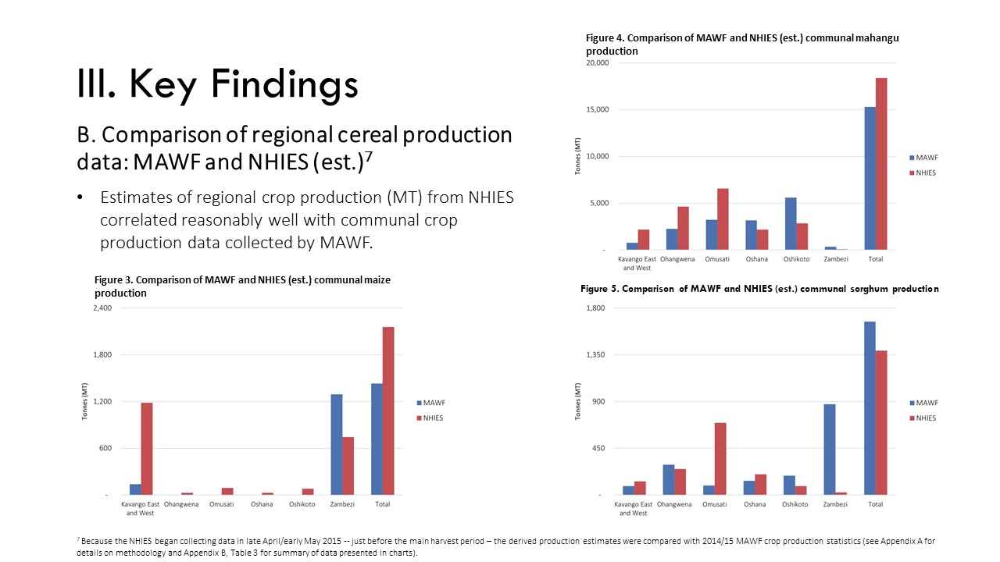

# NHIES Analysis

## Background
- The Namibia Food and Nutrition Security Policy and Implementation Action Plan (2019-2024) includes strategies to implement and strengthen mandatory fortification of staple foods and condiments.
- Data and analyses on food production and consumption within households are required to appropriately inform the design and implementation of food and nutrition security policies.
- From April 2015 to March 2016, the Namibia Statistics Agency undertook the Household Income and Expenditure Survey (NHIES).
- The survey collected valuable information on household food production and consumption throughout the country, including a 7-day food diary.

## Methodology
To better understand the household food production and consumption patterns within Namibia, a series of analyses were performed:
1. Analysis of household-level food consumption1 and grain production2 according to key demographics;
2. Comparison of regional cereal production data from MAWF and NHIES-derived estimates;
3. Mapping of regional and temporal variations in household-level grain consumption.

## Overview

**01_crop_production_additional_analysis.ipynb**: This notebook presents an in-depth analysis of crop production data, focusing on additional insights derived from the National Household Income and Expenditure Survey (NHIES) data. It includes exploratory data analysis, data cleaning processes, and statistical analysis to understand production trends and patterns.

**02_grain_consumption_HH_analysis.ipynb**: Similar to the first, this notebook extends the analysis to grain consumption patterns within households. Utilizing NHIES data, it explores consumption trends, identifies key factors affecting grain consumption, and examines the relationship between grain consumption and demographic factors.

**image_editing_process.ipynb**: This notebook diverges from the agricultural data analysis to focus on image editing processes. While a detailed description wasn't provided within the notebook, it likely encompasses techniques and methods for enhancing and manipulating images, potentially relevant to the presentation of data findings.

## Tools Used

- Python 3.x
- Jupyter Notebook or JupyterLab
- Pandas
- Matplotlib
- Seaborn
- (Any additional libraries used in the notebooks)

## License

This project is licensed under the MIT License - see the LICENSE.md file for details.
